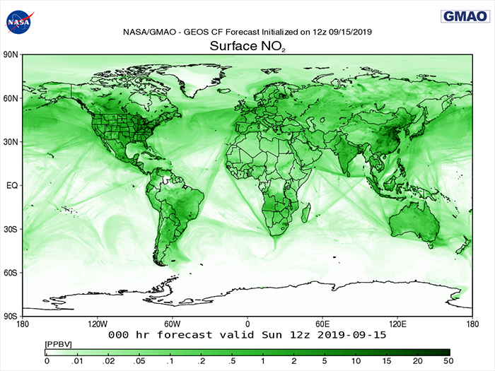
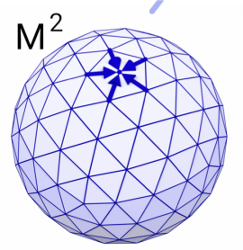
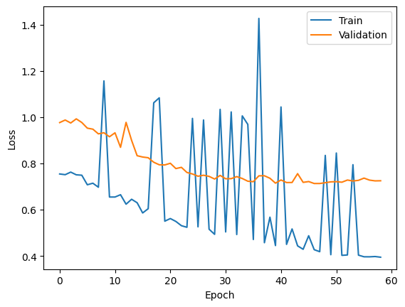
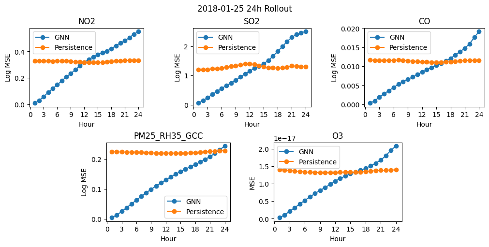
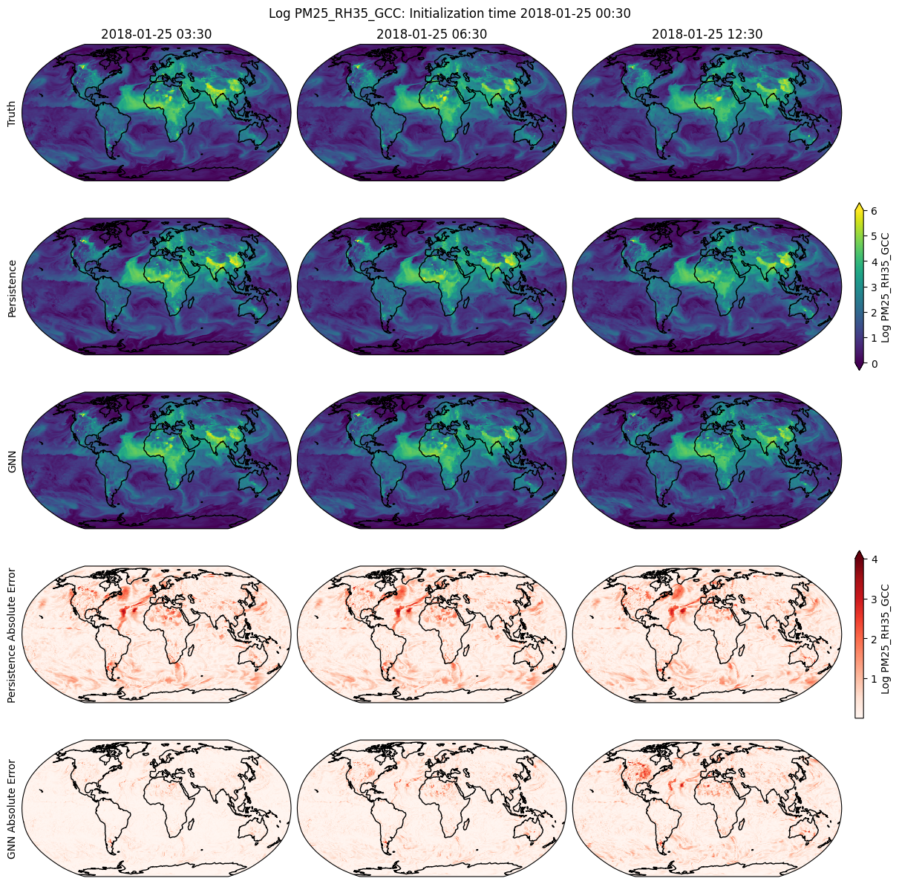

<center>
  
</center>

# Table of Contents
I. [Introduction](#introduction)

II. [Related Works](#related-works)

III. [Methods](#methods)

IV. [Discussion](#discussion)

V. [Ethical Sweep](#ethical-sweep)

VI. [Reflection](#reflection)

VII. [References](#references)

VIII. [Appendix](#appendix)

# Abstract
This project introduces a graph neural network (GNN) emulator of the [NASA GEOS-CF system](https://gmao.gsfc.nasa.gov/weather_prediction/GEOS-CF/) for forecasting global atmospheric composition. While the current NASA GEOS-CF system runs near real-time simulations, it is computationally expensive, and machine learning (ML) models can improve and speed up Earth system forecasts. The GNN emulator has an "encode-process-decode" architecture that transforms the original latitude-longitude data to a lower dimensional latent space, performs computations in this space, then reprojects back to the original latitude-longitude format for final predictions. The GNN learns on [publicly available GEOS-CF assimilated data](https://portal.nccs.nasa.gov/datashare/gmao/geos-cf/v1/das/) to make predictions on the global atmospheric composition of four chemical species (ozone, nitrogen dioxide, carbon monoxide, sulfur dioxide), and particulate matter (PM2.5). The model currently provides forecasts with 1 hour of lead time. This work is significant because atmospheric composition has tangible impacts on billions of people around the globe, and accurate forecasts of global atmospheric composition are crucial for human health, infrastructure, and climate change solutions.

# Introduction
The chemical composition of the atmosphere has tangible impacts for billions of people around the globe. It is tightly coupled with both surface air pollution levels, which are one of the leading environmental causes of death worldwide, and global climate change via mechanisms such as radiation scattering and aerosol-cloud interactions (GBD 2013 Risk Factors Collaborators et al. 2015; National Academies of Sciences, Engineering, and Medicine et al. 2016). As such, providing high resolution, accurate forecasts of global atmospheric composition is incredibly important for human health, infrastructure, and climate change solutions. The NASA Goddard Earth Observing System (GEOS) composition forecast modeling system, GEOS-CF, is the current state-of-the-art atmospheric composition forecasting system and runs near real-time simulations to provide high quality predictions. GEOS-CF is one of many recently developed Earth system models which predict various geophysical variables (e.g, chemical distributions, humidity, wind speed, etc.) using physical computer models that solve many governing equations on discrete physical grids. While such models have found success, it typically comes at the cost of speed and large computing requirements (Bauer et al. 2015). These tradeoffs have driven recent interest in developing machine learning (ML) models to both improve and speed up Earth system forecasts (Rasp et al. 2020; Watson-Parris et al. 2022). These machine learning models are purely data-driven and seek to emulate the Earth system dynamics without the use of specific governing laws and equations.

In this work, we introduce a graph neural network (GNN) emulator of the NASA GEOS-CF system for forecasting global atmospheric composition. Specifically, our model uses an "encode-process-decode" architecture to transform the original latitude-longitude data to a lower dimensional latent space, perform computations in this space, then re-project back to the original latitude-longitude format for final predictions (Battaglia et al. 2018). The GNN learns on publicly available GEOS-CF assimilated data to emulate its forecasts. Our work is most similar to that of Keisler and Lam et al. in that we use a GNN for making forecasts of Earth system variables. However, our approach differs in two distinct ways. First, we forecast global atmospheric composition of the four chemical speices, ozone (O<sub>3</sub>), nitrogen dioxide (NO<sub>2</sub>), carbon monoxide (CO), sulfur dioxide (SO<sub>2</sub>), as well as particulate matter (PM2.5), though Keisler's work made predictions of weather variables like humidity and temperature. To the authors' best knowledge, this is first work to emulate the NASA GEOS-CF system for making composition forecasts. Second, we make use of graph attention layers in our processor as opposed to the graph convolutional layers of Keisler and Lam et al.

Overall, we find that our GNN model outperforms the persistence forecast baseline while being much less computationally expensive as the physical GEOS-CF forecasting system. In future work, we hope to investigate the quality of forecasts in different parts of the world to identify any potential inequities and perform direct comparisons between our models forecasts and that of GEOS-CF.

# Related Works
### Atmospheric Composition
The [World Meteorological Organization (WMO)](https://public.wmo.int/en) tasks itself with assisting in the gathering and sharing of worldwide observational atmospheric composition data, which is produced by many agencies at both national and subnational levels, and in academia and the private sector. Klausen et al. discuss the importance of employing means to gather and share high quality comparable data at a global level, in the context of the WMO’s Unified Data Policy, and addressing issues such as lack of observational infrastructure in some parts of the world, inconsistent data quality, and the lack of sharing of available data with the international community. The GAW has devised guidelines for measuring and quality control when collecting observational data in order to ensure that data from different sources around the world can be comparable, and that meaningful conclusions can be drawn. Using optimal methods for collecting and monitoring this data is imperative for supporting policy for climate crisis solutions, predicting patterns in extreme weather, informing the process of recovery of the ozone layer, and the identification of levels of air pollutants, as well as concentrations of greenhouse gases, since they pose a threat to human health, ecosystems, and agriculture. As many countries have pledged to achieve net-zero greenhouse gas emissions, a failure to adequately manage this atmospheric observational data would preclude the ability to quantify both progress and setbacks toward current and future climate goals.

There have been recent works which make use of atmospheric observational data to improve chemical simulators. Notably, Geiss et al. use GEOS-CF data to train a machine learning model to downscale atmopsheric chemistry simulations with substantially higher accuracy than previous attempts.

### Graph Neural Networks
As explained by Sanchez-Lengeling et al., neural networks have been combined with graphs to leverage spatial properties of graphs. Graph neural networks (GNNs) are composed of vertex, edges, and global nodes where vertexes can be specified as directed or undirected. GNNs have been lervaged to cover a wide variety of projects including semantic language encodings, predicting bonds in molecules, and social networks. GNNs have also been encoded to widely model connections and figure out how information, ideas, or items interact with one another. 

Zhou et al. elaborate and notes that GNNs can capture the dependence and high amount of relational data of graphs via message passing between the nodes of graphs. GNNs and their variants, including propogation modules, sampling modules, and pooling modules, have had ground breaking performance in recent years. Zhou et al. also outline the design process for a GNN to be (1) Find the graph structure, as in what the nodes and edges will be, (2) specify graph type and scale, i.e. whether the graph is homogenous or heterogenous, directed or undirected, simply or dynamic, etc. (3) design the loss function, and finally (4) build the module using computational modules. 

Pfaff et al. build on more basic GNN models to build mesh-based models, which are highly adaptive, efficient architectures for neural networks with the ability to quickly pass information between nodes in a graph neural network. These models can make highly accurate and efficient predictions about the dynamics of physical systems. Pfaff et al. find that mesh graphs are generalizable and can be accurately applied to numerous different systems such as the weather and climate, often with much lower error rates than mesh-free models.

Keisler makes use of a mesh GNN model to learn from multi-resolution weather data make high resolution forecasts of various weather variables such as wind speed, humidity, and temperature. The architecture operates in three discrete steps: an encoder transforms some region of the world that we want to make predictions about into input vectors, a processor analyzes said input vectors, and a decoder maps the resulting output data back onto the physical map. Analysis of the model’s accuracy revealed that it performs either better or at parity with cutting-edge physical (non-ML) weather forecasters, motivating the usage of neural networks in the atmospheric predictions space.

Lam et al. build on the GNN of Keisler to create a highly accurate model for 10-day weather forecasts. Like Keisler's architecture, they use an encode-process-decode structure. The encoder maps from the physical latitute/longitude space to a latent graph. The processor does computation on the latent graph, which has less nodes than the original latitute/longitude. Lastly, the decoder maps from the latent graph back to the latitute/longitude space to create a real forecast. The primary difference between this model and that of Keisler for weather forecasting is that the authors of this work use a multi-scale mesh icosahedron for the latent graph while Keisler uses a static resolution icosahedron. That is, they use multiple icosahedrons of different resolutions to create their latent graph which the processor does computation on. This allows them to effectively capture spatial relations in the data. The low resolution icosahedrons can capture long distance connections and the high resolution icosahedrons can capture local connections.

# Methods
This model was trained on [NASA's GEOS Composition Forcasting (GEOS-CF) dataset](https://portal.nccs.nasa.gov/datashare/gmao/geos-cf/v1/das/). This data describes the chemical composition of Earth's global atmosphere (that is, concentrations of ozone, carbon monoxide, nitrogen dioxide, sulfur dioxide, and PM<sub>2.5</sub>) on one hour intervals from January 2018 through today. One input vector in the datset represents the concentrations of these aerosols for a single hour at a single coordinate pair (with additional vectors for that time step representing concentrations spaced 0.25 degrees apart in both the latitude and longitude directions). Data was scraped and downloaded as a series of [NC4 files](https://www.loc.gov/preservation/digital/formats/fdd/fdd000332.shtml) (with one file representing one hourly time step) using [GNU's wget software](https://www.gnu.org/software/wget/).

```
wget -i files.txt
# "files.txt" would be filled in with the name and path of a folder holding all .nc4 files we want to download.
# Downloaded via the command line.
```
**Figure 1.** Code snippet outlining how .nc4 files were downloaded from the GEOS-CF database. By running wget on the command line, we could download large quantities of data in minutes (e.g. three months worth of data, composed of several thousand large datasets, downloaded in approximately 30 minutes using wget).

Data from January 1st, 2018 through March 31st, 2018 was used to train and validate this model. Different data sets were created from different sets of days: the first 18 days of each month made up the training set, the next 6 days were used in the validation set, and the remaining days composed the test set. This made sure that each data set contained data from different months, accounting for changing wind currents (and, as a consequence, changing aerosol concentrations) and making sure the model was exposed to as diverse a dataset as possible at every step of the training process. The model was designed to make predictions about aerial CO, NO<sub>2</sub>, O<sub>3</sub>, PM<sub>2.5</sub>, and SO<sub>2</sub>.

But before training can begin, data is normalized so that all modeling occurs on a normally distributed dataset. To accomplish this, all NC4 files are fed into a normalization algorithm which calculates the overall mean and standard deviation of the dataset and uses these to convert each initial concentration (that is, the approximately 5 million concentration values for each compound in each latitude, longitude pair for each of the approximately 2000 analyzed time steps) into a normally distributed value. For all compounds except O<sub>3</sub>, this process was done with the following equation:  , where  and  are the mean and standard deviation of the natural log of the chemical, and  is 10^(-32) to prevent us from ever taking the logarithm of 0. Ozone, meanwhile, was not lognorammly distributed; therefore, all concentrations were scaled by 4x10^6 to keep all values within [0, 1]. Data was also upscaled by a factor of 4 to reduce its resolution for easier predictions. The final resoltuion was 180 latitude x 360 longitude. Output data is formatted into a 3-dimensional table (with dimensions latitude, longitude, and time) containing some two billion normalized, float compound concentrations in an approximately 8gb file.

```
Dimensions:        (time: 2160, lat: 180, lon: 360)
Coordinates:
  * lon            (lon) float64 -179.6 -178.6 -177.6 ... 177.4 178.4 179.4
  * lat            (lat) float64 -89.62 -88.62 -87.62 ... 87.38 88.38 89.38
  * time           (time) datetime64[ns] 2018-01-01T00:30:00 ... 2018-03-31T2...
Data variables:
    CO             (time, lat, lon) float32 ...
    NO2            (time, lat, lon) float32 ...
    O3             (time, lat, lon) float32 ...
    PM25_RH35_GCC  (time, lat, lon) float32 ...
    SO2            (time, lat, lon) float32 ...
```
**Figure 2.** Dimensions and first several values of our normalized data.

Data is then passed into a graph neural network (GNN). At a high level, the GNN is composed of three discrete layers: an encoder, which transforms the latitude/longitude gridded input data into a mesh graph, a processor, which updates features on the mesh graph, and a decoder, which functions as a reverse encoder by transforming the mesh back into parsable data on a latitude/longitude grid.

As mentioned above, the encoder's primary role is to transform the lat/lon grid data into a form that can be computed by the GNN. The encoder takes as input a tuple containing information on the desired batch size, grid features, and grid feature dimensions. Each physical grid cell is mapped to a node on a level 2 icosahedron graph which has 5182 nodes (illustrated in the image below) to create a bipartite graph; one of the graph's partitions contains the concentrations of each of the 5 chemicals at each spatial grid point while the other contains an icosahedron grid. An edge is constructed between a grid node and a physical node if a spatial location is closest to the chosen grid node; in short, each node in the mesh only contains information about nearby spatial points. Lastly, a simple MLP with 2 hidden layers of 256 neurons each, LayerNorm, and SiLU activation is used to learn the features of each node in the icosahedron mesh based on the lat/lon grid cells it is connected to in the bipartite graph.

<center>
  
</center>

**Figure 3.** Visual representation of the constructed icosahedron mesh.

From here, the encoder passes the icosahedron mesh to the processor. The processor can be broken down into two subsections: a graph attention network (GAT) responsible for training on the mesh's edge attributes and a graph convolutional network (GCN), which trains and updates each node's features. While complex, the basic idea of these two components is that edge features are updated using information from nearby nodes, and node features are updated using information from nearby edges. The processor passes over the mesh several times, exchanging information in each node with the node's neighbors. This process is called "message passing", and it allows nodes to gather information from other nodes which are far away given enough rounds information exchange. Throughout this process, the node's features change in response to the information being fed from neighboring nodes, allowing the system to make predictions about NO<sub>2</sub> concentrations in a given area based on NO<sub>2</sub> concentrations in the surrounding area.

Finally, the mesh is passed through the decoder. The decoder is the functional opposite of the encoder; a bipartite graph is constructed from the icosahedron mesh to a lat/lon grid, and an idential MLP to the encoder is used to predict the *1 hour change* in  5 chemical concentrations in a given lat/lon grid cell using the features of the icosahedron nodes it is connected to in the bipartite graph. From here, we have a residual connection back to the input to get a final prediction of chemical concentrations 1 hour after the input, and we can plot this prediction to gain visual insight into the model's projections.

We used normalized MSE loss as the objective function, where both the prediction and target for each chemical are divided by the standard deviation of the 1 hour change in chemical concentration in the training data before calculating MSE as usual. The motivation for this is that each our model predicts the 1 hour change in chemical concentrations, which may have different magnitude for each chemical. For the optimizer, we used Adam with a learning rate of 0.0001. Additionally, we reduce the learning rate by a factor of 10 after validation loss has stopped decreasing for 5 epochs, and we stop training if validation loss has not improved for 10 epochs. Under this current regime, one epoch takes approximately 25 minutes to run. All components of the network were designed using [PyTorch](https://pytorch.org/docs/stable/index.html) and [PyTorch Geometric](https://pytorch-geometric.readthedocs.io/en/latest/).

# Discussion
As previously discussed, we train our model on three months (Jan. 2018 - Mar. 2018) of NO<sub>2</sub> data. The train-validation-test split from the previous section resulted in 1296 samples for the training set, each a 180x360 grid of atmospheric NO<sub>2</sub> composition. Given one of these samples, the goal is to predict the state of atmospheric NO<sub>2</sub> one hour later. We choose this amount of lead time since it is the time step used by the physical GEOS-CF model which we are attempting to emulate.

Since the model is somewhat large and the inputs are high resolution, we use a batch size of 1. Any higher would cause the Google Colab GPU we used to train the model to run out of memory (15 GBs). Colab was chosen because it provided large amounts of storage and memory in addition to convenient file sharing that fulfilled the computing needs of our project. This small batch sized combined with the aforementioned model size and input resolution lead to relatively slow training, about 25 minutes per epoch. Our model trained for 59 epochs before early stopping, and we show the loss curves below.

<center>
  
</center>

We evaluate the model using Log MSE for NO<sub>2</sub>, SO<sub>2</sub>, CO, and PM<sub>2.5</sub>, which is simply the MSE of the natural log of both the prediction and target. The motivation for this is that the actual concentrations of these chemicals are lognormally distributed, so evaluating and plotting raw concentrations as opposed to their logs yields relatively uninterpretable results. O<sub>3</sub> is evaluated using standard MSE because it is not lognormally distributed. This method of evaluation is also used in Geiss et al. 2022. We test our model using a 24 hour rollout forecast starting from 2018-01-25 00:30 UTC. This means we make a prediction for 2018-01-25 01:30 UTC, plug this back into our model to predict 2018-01-25 02:30 UTC, and so on for a full 24 hour forecast. For comparison, we use the *persistence* forecast, which says that the chemical concentrations at a given hour are the same as the concentrations 24 hours prior. This is a common baseline in the weather forecasting community since some variables tend to stay constant on daily timescales. Our GNN's errors for each chemical during each hour of this forecast are shown below alongside the persistence forecasts's errors. Overall, we see that our model accumulates larger errors with more and more autoregressive steps, which is to be expected. However, we are still able to consistently beat the persistence baseline for up to 12 hours, with some chemical predictions beating persistence for closer to 24 hours.

<center>
  
</center>

We also show below a visual summary of our model's predictions for PM<sub>2.5</sub> alongside the persistence forecast and true values. Absolute errors in prediction for persistence and the GNN are shown in the last two rows. Overall, we see that our model is able to better predict the global distribution of PM<sub>2.5</sub> than the persistence baseline.

<center>
  
</center>

# Ethical Sweep
**General Considerations:** At a high level, this work may help provide accurate forecast models which can help promote global health and awareness for changes in climate. This work can help these causes and has close to no negative use cases. Current approaches use fully-integrated physical chemistry models and simulations in order to forecast composition. Due to the complexity in forecasting, a limited GNN may not provide accurate results for forecasting and may require additional data. Our team consists of a mix of computer science, math, and environmental analysis majors with semi-similar backgrounds, but a few outliers. It is not as diverse as we would hope for in terms of academic background, in part because the topic is not easily approachable. However, it seems we have different experiences and identities in terms of socioeconomic background, ethnicity, and gender. To handle mistakes, we will discuss them during project meetings and go over miscommunications in person for dividing tasks. Additionally, we may check over each other's work to preemptively catch errors.

**Data Curation and Use:** We believe that our data is valid for its intended use. It is simply a collection of global GEOS-CF predictions coupled with real satellite observations. Of any dataset, this one is most well suited for our goal of predicting future atmospheric composition. The most obvious bias that the data could contain is spatial bias. It could be the case that NASA's own predictions or satellite observations are better over certain parts of the globe than others. This may be due to model design choices or sparse observations in specific areas of the globe. We must be aware that this may lead our own forecasting model to make better predictions for certain countries or regions. To combat this, we may look for other data sources to ensure that we have quality data across the entire globe. Furthermore, we may look into ways to enforce spatial fairness constraints into our GNN model. One way we could audit our data and code is to review NASA's own data curation process and make an assessment on its validity and fairness. Additionally, once we have a trained GNN model, we could look at error rates in different regions of the Earth to ensure that our model has similar prediction accuracy across the globe.

**Impact Assessment:** There is a chance we see different error rates for different sub-groups. In this project, sub-groups will be split geographically (e.g. we may have a set of data from western North America, another set from east Asia, etc.); if NASA's GEOS-CF database has not equally sampled from all across the world, then it is possible that some sub-groups with less overall data will have larger error rates due to undertraining on our model. With that said, GEOS-CF holds a fairly mature, developed dataset that has been built by diverse groups of researchers from around the world, so it seems likely that any severe discrepancies in sub-group sampling size have been dealt with by now. One potential path for data misinterpretation could occur when we train our graph neural network. GNN's function by exchanging information with their neighbors; therefore, if individual nodes in the GNN are trained on poor datasets, there is a risk that they decrease the accuracy of neighboring nodes with their own incorrect conclusions and incomplete datasets. A mistake like this could have cascading effects on our entire GNN and severely limit our ability to meaningfully analyze global atmospheric conditons. Preventing this issue goes back to making sure we train our neural network on a good dataset (and, relatedly, taking care to measure the performance of individual nodes and layers, rather than just looking at the GNN as a whole). Fortunately, our GNN deals exclusively with high-level, impersonal atmospheric data, leaving little room for infringing on others' privacy. The only potential privacy risk could come from inadvertently revealing the name of an individual who contributed data to the GEOS-CF dataset (if such data is even recorded by NASA's database).

# Reflection
When we started dividing up the tasks for each component of the project, we assigned the encoder and decoder to Will and Francine, the processor to Elly and Alex, and the data downloading, normalization, and storage to Ryan. We all unanimously agreed and planned to switch around the responsibilities for each component, so that we would all have a chance to understand and develop each one. A couple weeks after we started working on the project, we decided to continue with the same responsibilities that we initially assigned to ourselves, as each component was too large a task for us to swap roles. Since we had already spent so much time learning about our own components, we thought that if we had chosen to alternate responsibilities, it would have produced more obstacles for us and stalled our process. However, in the future we would like to learn more from one another about the details of the process of creating and developing each component, and potentially swap around responsibility as we continue to develop and add complexity.

As we continue working on this project, we need to put more conscious thought and effort into how we can increase its scale. This applies both to the data and the model. Already, we are starting to push the limits of how much data we can store, compute, and run through the model on our own laptops. Though the Pomona College Computer Science department’s server is an option, we would still be pushing the limits of that too if we scale up in the ways we want. So, we need to find and discuss better options, or wait until we have access to more computational resources.

Going forward, we want to introduce more complexity to our project. Right now, we are only training and making predictions with our model for only one variable, the chemical compound NO<sub>2</sub>. The model detailed in the Keisler paper was trained on 78 variables, including wind speed, humidity, and temperature. We are using only one variable right now, which is better for tractability, but in the future we plan to extract data for all four chemical species: ozone, nitrogen dioxide, carbon monoxide, sulfur dioxide, as well as particulate matter, and use our model to make predictions on all of their compositions. Another possibility would be to develop a neural network to make predictions for all four chemical species and particulate matter at once. Though this might be incredibly computationally expensive, it would be awesome.

# References
Battaglia, P. W., and Coauthors, 2018: Relational inductive biases, deep learning, and graph networks. arXiv preprint arXiv:1806.01261.

Bauer, P., A. Thorpe, and G. Brunet, 2015: The quiet revolution of numerical weather prediction. Nature, 525 (7567), 47–55.

GBD 2013 Risk Factors Collaborators, and Coauthors, 2015: Global, regional, and national comparative risk assessment of 79 behavioural, environmental and occupational, and metabolic risks or clusters of risks in 188 countries, 1990–2013: a systematic analysis for the global burden of disease study 2013. Lancet (London, England), 386 (10010), 2287.

Geiss, A., S. J. Silva, and J. C. Hardin, 2022: Downscaling atmospheric chemistry simulations with physically consistent deep learning. Geoscientific Model Development, 15 (17), 6677–6694.

Keisler, R., 2022: Forecasting global weather with graph neural networks. arXiv preprint arXiv:2202.07575.

Klausen, J., C. Volosciuk, O. Tarasova, and S. Netcheva, 2021: Benefits of atmospheric composition monitoring and international data exchange. Bolet ́ın-Organizaci ́on Meteorol ́ogica Mundial, 70 (2), 41–46.

Lam, R., and Coauthors, 2022: Graphcast: Learning skillful medium-range global weather forecasting. arXiv preprint arXiv:2212.12794.

National Academies of Sciences, Engineering, and Medicine, and Coauthors, 2016: The future of atmospheric chemistry research: remembering yesterday, understanding today, anticipating tomorrow. National Academies Press.

Pfaff, T., M. Fortunato, A. Sanchez-Gonzalez, and P. W. Battaglia, 2020: Learning mesh-based simulation with graph networks. arXiv preprint arXiv:2010.03409.

Rasp, S., P. D. Dueben, S. Scher, J. A. Weyn, S. Mouatadid, and N. Thuerey, 2020: Weatherbench: a benchmark data set for data-driven weather forecasting. Journal of Advances in Modeling Earth Systems, 12 (11), e2020MS002 203.

Sanchez-Lengeling, B., E. Reif, A. Pearce, and A. B. Wiltschko, 2021: A gentle introduction to graph neural networks. Distill, 6 (9), e33. Watson-Parris, D., and Coauthors, 2022: Climatebench v1. 0: A benchmark for data-driven climate projections. Journal of Advances in Modeling Earth Systems, 14 (10), e2021MS002 954.

Zhou, J., and Coauthors, 2020: Graph neural networks: A review of methods and applications. AI open, 1, 57–81.

# Appendix
## Old Work
All text in this section is saved previous work. It may be ignored.
### Related Works

**(Keisler, R.) Forecasting Global Weather With Graph Neural Networks**. Graph neural networks are uniquely suited to modelling complex weather systems due to their ability to learn multi-resolution models (that is, output models with different degrees of forecast specificity depending on whether the model is being used to predict weather in a local town or large country) and more accurately modelling shifts in weather over user-defined time steps. The architecture built by the authors of this paper operates in three discrete steps: an encoder transforms some region of the world that we want to make predictions about into input vectors, a processor analyzes said input vectors, and a decoder maps the resulting output data back onto the physical map. Analysis of the model's accuracy revealed that it performs either better or at parity with cutting-edge physical (non-ML) weather forecasters, motivating the usage of neural networks in the atmospheric predictions space. Link: https://arxiv.org/pdf/2202.07575.pdf

**(Klausen et al.) Benefits of Atmospheric Composition Monitoring and International Data Exchange.** The WMO (World Meteorological Organization) tasks itself with assisting in the gathering and sharing of worldwide observational atmospheric composition data, which is produced by many agencies at both national and subnational levels, and in academia and the private sector. This article discusses the importance of employing means to gather and share high quality comparable data at a global level, in the context of the WMO’s Unified Data Policy, and addressing issues such as lack of observational infrastructure in some parts of the world, inconsistent data quality, and the lack of sharing of available data with the international community. The GAW has devised guidelines for measuring and quality control when collecting observational data in order to ensure that data from different sources around the world can be comparable, and that meaningful conclusions can be drawn. Using optimal methods for collecting and monitoring this data is imperative for supporting policy for climate crisis solutions, predicting patterns in extreme weather, informing the process of recovery of the ozone layer, and the identification of levels of air pollutants, as well as concentrations of greenhouse gases, since they pose a threat to human health, ecosystems, and agriculture. As many countries have pledged to achieve net-zero greenhouse gas emissions, a failure to adequately manage this atmospheric observational data would preclude the ability to quantify both progress and setbacks toward current and future climate goals. Link: https://public.wmo.int/en/resources/bulletin/benefits-of-atmospheric-composition-monitoring-and-international-data-exchange

**(Lam et al.) GraphCast: Learning Skillful Medium-Range Global Weather Forecasting**. In this work, the authors bulid on previous graph neural net (GNN) architectures to create a highly accurate model for 10-day weather forecasts. Like previous GNN architectures, they use an encoder-processor-decoder structure. The encoder maps from the physical latitute/longitude space to a latent graph. The processor does computation on the latent graph, which has less nodes than the original latitute/longitude. Lastly, the decoder maps from the latent graph back to the latitute/longitude space to create a real forecast. The primary difference between this model and other GNN architectures for weather forecasting is that the authors of this work use a multi-scale mesh icosahedron for the latent graph. That is, they use multiple icosahedrons of different resolutions to create their latent graph which the processor does computation on. This allows them to effectively capture spatial relations in the data. The low resolution icosahedrons can capture long distance connections and the high resolution icosahedrons can capture local connections. Link: https://arxiv.org/pdf/2212.12794.pdf

**(Pfaff et al.) Learning Mesh-Based Simulation With Graph Networks**. Mesh-based models are highly adaptive, efficient architectures for neural networks with the ability to quickly pass information between nodes in a graph neural network, resulting in a system that can perform highly accurate and efficient predictions about the dynamics of physical systems. This paper's authors found that mesh graphs are generalizable and can be accurately applied to numerous different systems (weather and particle dynamics among them), often with much lower error rates than mesh-free models. Link: https://arxiv.org/pdf/2010.03409v4.pdf

**(Sanchez-Lengeling et al.) A Gentle Introduction to Neural Networks**. Neural networks have been combined with graphs to leverage spatial properties of graphs. Graph Neural networks are composed of vertex, edges, and global nodes where vertexes can be specified as directed or undirected. GNNs have been lervaged to cover a wide variety of projects including semantic language encodings, predicting bonds in molecules, and social networks. GNNs have also been encoded to widely model connections and figure out how information, ideas, or items interact with one another. This resource provides a few interactive exmaples along with more advanced introductions to GANs and Generative Modeling. Link: https://distill.pub/2021/gnn-intro/

**(Zhou et al.) Graph neural networks: A review of methods and applications** Graph neural networks are models that capture the dependence and high amount of relational data of graphs via message passing between the nodes of graphs. GNNs and their variants have had ground breaking performance in recent years. Models for GNNs are built using a variety of modules, including propagation modules, sampling modules, and pooling modules. The paper provides a variety of instantiations of these computational modules, more details for which could be found in the futher papers linked out. The paper outlines the design process for a GNN to be (1) Find the graph structure, as in what the nodes and edges will be, (2) specify graph type and scale, i.e. whether the graph is homogenous or heterogenous, directed or undirected, simply or dynamic, etc. (3) design the loss function, and finally (4) build the module using computational modules. The paper also explores analyses and applications of GNNs. Link: https://doi-org.ccl.idm.oclc.org/10.1016/j.aiopen.2021.01.001

### Introduction Outline

**Team Members:** Alex Fay, Elly Rokeach, Francine Wright, Ryan O'Hara, William Yik

**Problem Introduction:** Highly concentrated air pollutants are widespread across the globe and have been linked to negative health outcomes for a variety of different populations.

**GEOS-CF Overview:** The Goddard Earth Observing System composition forecast (GEOS-CF) is NASA's state-of-the-art modeling system for global atmospheric composition.

**Graph Neural Network Introduction:** Graph neural networks, which utilize the structures and properties of graphs to successfully model complex systems, have been highly successful in emulating global atmospheric and weather conditions.

**Methods Overview:** Broadly, we developed and trained a GNN on the GEOS-CF dataset to predict future distributions of air pollutants such as ozone.

**Details of Data Collection:** The main technical challenge we faced during this project was in developing an accurate, well-trained GNN.

**Conclusions:** Ideally, our model will be able to draw on old atmospheric composition data to make accurate predictions about air quality in various regions around the world.

**Future Directions:** In order to make our model more useful to the atmospheric science community, we hope to expand the number of parameters that our model is trained on.

### Project Description 
The Goddard Earth Observing System composition forecast (GEOS-CF) is NASA's state-of-the-art modeling system for global atmospheric composition [1]. It provides high resolution global forecasts of several chemical species including ozone (O<sub>3</sub>), nitrogen dioxide (NO<sub>2</sub>), and carbon monoxide (CO). Several of these chemicals are air pollutants and/or aersols which have tangible impacts for people around the world. Thus, providing accurate forecasts of their global distribution is key for global health and infrastructure. During the past few years, the development of large global weather, climate, and atmospheric composition models like GEOS-CF which are based on physical laws and differential equations has motivated the creation of machine learning systems which emulate these models [2,3]. The goal of such emulators is to achieve the prediction accuracies of physical models at a fraction of the cost. 

One type of machine learning model that has gained traction in recent years for forecasting tasks is the graph neural network (GNN) [4,5]. These neural networks leverage the structure and properties of graphs and have been successfully applied to emulate global weather features such as temperature, humidity, and wind [6]. This recent success motivates my interest in applying GNNs to emulate the GEOS-CF forecasts. NASA has maintained an assimilated database atmopsheric composition of the Earth since 2018, which is a combination of model predictions and satellite observations. This data could be used to train a GNN, the predictions of which could be compared to the actual GEOS-CF model. If successful, this project could provide a computationally cheaper way to achieve similar results to the GEOS-CF model.

While I think the bulk of the work for this project will be in understanding, designing, and training a reasonable GNN emulator, a potential longer term goal of this project would be to investigate methods for adding physical constraints into the GNN, as neural networks do not necessarily follow laws of physics such as mass conservation out of the box. Ensuring that neural networks are properly physically constrained is a rich research area in data-driven climate science communities [7]. Additionally, should the project succeed, I have a personal goal of writing an academic paper and submitting it for publication to a conference or journal.

[Sam Silva](https://www.samjsilva.com/), Professor of Earth Sciences and Civil and Environmental Engineering at USC, has graciously offerred to provide guidance for this project. He is an expert in computational atmospheric chemistry, and he has ongoing projects applying graph networks to atmopsheric science. His level of involvment will likely depend on how much progress we make on our own and how often we get stuck.

### Project Goals
1. Explore and make use of the NASA's GEOS-CF database of atmospheric composition. Make informed decisions on manipulating the data (e.g., upscaling).
2. Understand and design a reasonable GNN model.
4. Train this model on the GEOS-CF dataset and make any predictions at all (even poor ones).
5. Make informed edits to the model to improve forecasting accuracy.
6. Write an academic paper documenting our model/results and submit it for publication.

### Works Cited
[1] Keller, C. A., Knowland, K. E., Duncan, B. N., Liu, J., Anderson, D. C., Das, S., ... & Pawson, S. (2021). Description of the NASA GEOS composition forecast modeling system GEOS‐CF v1. 0. Journal of Advances in Modeling Earth Systems, 13(4), e2020MS002413.

[2] Rasp, S., Dueben, P. D., Scher, S., Weyn, J. A., Mouatadid, S., & Thuerey, N. (2020). WeatherBench: a benchmark data set for data‐driven weather forecasting. Journal of Advances in Modeling Earth Systems, 12(11), e2020MS002203.

[3] Watson‐Parris, D., Rao, Y., Olivié, D., Seland, Ø., Nowack, P., Camps‐Valls, G., ... & Roesch, C. (2022). ClimateBench v1. 0: A Benchmark for Data‐Driven Climate Projections. Journal of Advances in Modeling Earth Systems, 14(10), e2021MS002954.

[4] Zhou, J., Cui, G., Hu, S., Zhang, Z., Yang, C., Liu, Z., ... & Sun, M. (2020). Graph neural networks: A review of methods and applications. AI Open, 1, 57-81.

[5] Cao, D., Wang, Y., Duan, J., Zhang, C., Zhu, X., Huang, C., ... & Zhang, Q. (2020). Spectral temporal graph neural network for multivariate time-series forecasting. Advances in neural information processing systems, 33, 17766-17778.

[6] Keisler, R. (2022). Forecasting Global Weather with Graph Neural Networks. arXiv preprint arXiv:2202.07575.

[7] Beucler, T., Pritchard, M., Rasp, S., Ott, J., Baldi, P., & Gentine, P. (2021). Enforcing analytic constraints in neural networks emulating physical systems. Physical Review Letters, 126(9), 098302.
